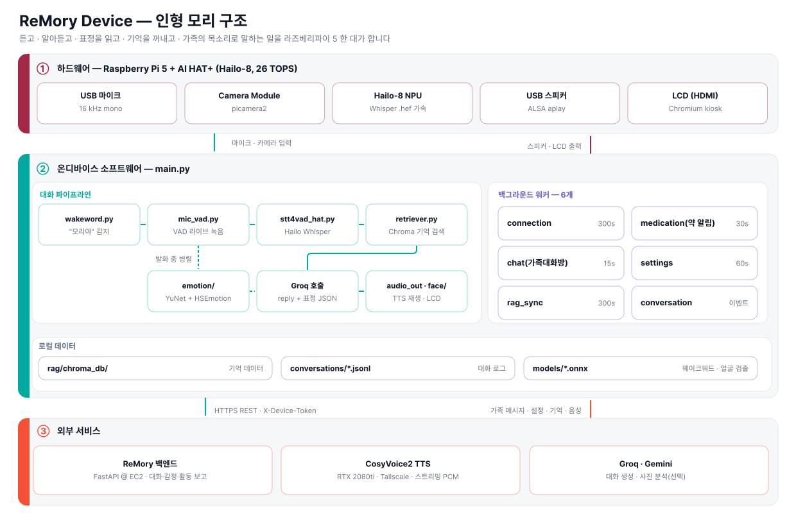
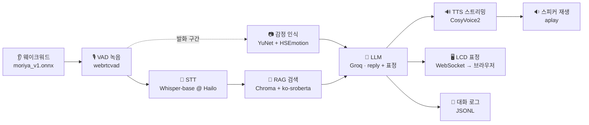

<div align="center">

# 🧸 ReMory Device

**치매 어르신과 가족을 잇는 돌봄 인형, 모리(Mori)의 온디바이스 코드**

"모리야" 하고 부르면 인형이 깨어나 대화를 시작합니다.
듣고 · 알아듣고 · 표정을 읽고 · 기억을 꺼내고 · 가족의 목소리로 대답합니다.

<br/>


</div>

---

## 📖 이런 서비스입니다

치매를 앓는 어르신은 하루 대부분을 혼자 보냅니다. 가족은 멀리 있고,
"오늘 어떠셨어요?" 를 물어볼 방법이 전화밖에 없습니다.

**리모리는 어르신 곁에 인형을 둡니다.** 인형 *모리* 는 어르신과 대화를 나누고,
가족이 남긴 메시지를 **가족의 목소리로** 읽어주고, 약 드실 시간을 알려줍니다.
그 사이에 쌓인 대화·감정·활동은 가족 앱의 홈 화면과 하루 리포트로 정리되어 전달됩니다.

<table>
<tr>
<td width="33%" valign="top">

### 👵 어르신
말벗이 되어주는 인형 **모리**.
"모리야" 하고 부르면 대답하고,
사진 속 추억을 함께 이야기하고,
약 시간을 챙겨줍니다.

</td>
<td width="33%" valign="top">

### 🧸 인형 (Device)
Raspberry Pi 5 + 카메라·마이크·스피커.
대화·감정·활동을 서버에 올리고,
가족 메시지와 어르신 정보(RAG)를
서버에서 받아 갑니다.

</td>
<td width="33%" valign="top">

### 👨‍👩‍👧 가족 (보호자)
Flutter 앱으로 어르신 상태를 보고,
대화방에 메시지·사진을 남기고,
자기 목소리를 등록하고,
데일리 리포트를 받습니다.

</td>
</tr>
</table>

---

## 🗺 시스템 구성

<div align="center">
  
</div>

<br/>

**전체 서비스에서 이 저장소의 자리**

| | 무엇을 하나 | 핵심 |
|---|---|---|
| **① 엣지 · 인형 모리** | 📍 **이 저장소** | Raspberry Pi 5 + AI HAT+ · 카메라/마이크/스피커/LCD<br/>웨이크워드 → STT → 얼굴·표정 감정 인식을 **기기 안에서** 처리 |
| **② AI 처리** | 이해하고 목소리를 만든다 | Groq API(대화 생성) · CosyVoice2 자체 호스팅(TTS·가족 음성 클로닝) |
| **③ AWS 클라우드** | 가족 앱과 인형을 잇는다 | EC2 위의 FastAPI · 패스키 인증 · PostgreSQL · Vector DB(RAG) · S3 |
| **보호자 앱** | 가족이 보는 화면 | Flutter (iOS·Android) → HTTPS REST |

> 🔒 **얼굴 원본은 엣지에서 즉시 폐기하고 감정 라벨만 서버로 보냅니다.**
> 어르신 얼굴 이미지는 네트워크를 타지 않습니다.

> 🔗 백엔드 서버는 [Hanium-Remory/backend](https://github.com/Hanium-Remory/backend) 에 있습니다.

---

## 🔁 한 턴이 흘러가는 길



**동시에 백그라운드에서 도는 것들**

| 워커 | 주기 | 하는 일 |
|---|---|---|
| 💓 `connection_worker` | 300s | "인형이 연결되어 있음"을 서버에 알림 (600s 넘게 끊기면 앱에 '연결 끊김') |
| 💊 `medication_worker` | 30s | 약 시간이 되면 음성 안내 → 활동 기록 → 15분 뒤 복용 확인 |
| 💬 `chat_worker` | 15s | 가족이 보낸 글은 TTS 로, 사진은 화면에 60초 표시 |
| ⚙️ `settings_worker` | 60s | 볼륨 · 방해 금지 시간 · 기본 목소리(화자 id) 동기화 |
| 🧠 `rag_sync_worker` | 300s | 앱에 올라온 사진·추억을 받아 Chroma 증분 갱신 |
| 🗨 `conversation_worker` | 이벤트 | 대화 시작/종료 보고를 순서대로 전송 (앱의 '대화중' 표시) |

---

## 🛠 설계에서 신경 쓴 것

- 🔒 **프레임을 모아두지 않습니다.** 발화 중 0.7초 간격으로 캡처해 그 자리에서 바로 분류하고 버립니다. 메모리에 남는 건 라벨별 누적 점수뿐이라, 턴이 끝나도 되돌릴 원본이 없습니다.
- 🎯 **말이 끝난 걸 스스로 압니다.** VAD 오탐 한 프레임에 침묵 카운터가 리셋되지 않도록 "2프레임 이상 연속 음성"일 때만 리셋합니다. 어르신의 느린 말 사이 쉼을 문장 끝으로 오해하지 않습니다.
- 🙉 **환청을 걸러냅니다.** 0.4초 미만 클립은 아예 STT 를 건너뛰고, 결과에 한글이 한 글자도 없으면 버립니다. (`"you"`, `"Thanks for watching"` 같은 Whisper 특유의 무음 환청)
- 🔇 **스피커는 하나뿐입니다.** 대화 TTS · 약 알림 · 가족 메시지가 서로 말을 끊지 않도록 `speaker_lock` 으로 줄을 세우고, 어르신이 말하는 중(`recording`)이면 알림을 그 턴이 끝날 때까지 미룹니다.
- ⏱ **네트워크가 대화를 막지 않습니다.** '대화중' 보고는 큐에 넣고 즉시 돌아오고, TTS 는 청크를 미리 받아 쌓아두고 재생합니다.
- 🩹 **부품이 없어도 죽지 않습니다.** 카메라가 없으면 감정 없이, LCD 가 없으면 표정 없이, RAG 데이터가 없으면 기억 없이 — 대화 자체는 계속됩니다.

---

## 🧰 하드웨어 · 기술 스택

| 영역 | 사용 기술 | 메모 |
|---|---|---|
| **본체** | Raspberry Pi 5 + AI HAT+ (Hailo-8) | 온디바이스 STT 가속 |
| **웨이크워드** | openWakeWord + 자체 학습 `moriya_v1.onnx` | CPU 추론, 0.25초 간격 · threshold 0.65 |
| **녹음/VAD** | PyAudio + `webrtcvad` (aggressiveness 2) | RMS 에너지 게이트 병행, 말끝 침묵 2초로 종료 |
| **STT** | Whisper-base `.hef` @ Hailo GenAI | `small.hef` 은 언어 파라미터 무시 버그가 있어 base 사용 |
| **감정 인식** | YuNet(얼굴 검출) + HSEmotion(AffectNet 8감정) | picamera2 · 0.7초 간격 샘플 → 신뢰도 가중 다수결 |
| **RAG** | Chroma + `jhgan/ko-sroberta-multitask` | 안정 ID 기반 증분 동기화 (사진 수백 장도 빠름) |
| **비전 분석** | Gemini 2.5 Flash (선택) | 사진 → 기억 텍스트. 꺼두면 보호자 설명을 그대로 사용 |
| **LLM** | Groq (`openai/gpt-oss-120b`) | JSON 모드로 `reply` + `expression` 동시 생성 |
| **TTS** | CosyVoice2 스트리밍 (RTX 2080ti 서버) | Tailscale 사설망 경유 · 가족 목소리 화자 지정 |
| **얼굴 표시** | WebSocket(8765) → Chromium kiosk + SVG | 표정 6종 + 말할 때 입 움직임 + 가족 사진 오버레이 |
| **오디오 출력** | ALSA `aplay` (`plughw:CARD=UACDemoV10`) | 볼륨은 `amixer` 로 서버 설정값 반영 |

---

## 📁 프로젝트 구조

```
main.py              🎯 통합 파이프라인 + 백그라운드 워커 6종
wakeword.py          "모리야" 감지 (openWakeWord 임베딩 → ONNX)
mic_vad.py           라이브 VAD 녹음 (발화 시작/끝 콜백 제공)
audio_out.py         스피커 재생 + CosyVoice2 스트리밍 TTS
conversation_log.py  대화 한 턴을 로컬 JSONL 로 저장 (백엔드가 pull)

stt/
└── stt4vad_hat.py   Hailo Whisper STT + 환청 필터

emotion/
├── config.py        모델 경로 · 카메라 · 감정 라벨(한글 매핑)
├── vision.py        picamera2 캡처 → YuNet 검출 → HSEmotion 분류
└── emotion_service.py  발화 구간 동안 샘플링 → 다수결 라벨

rag/
├── retriever.py       기억 검색 + LLM 컨텍스트 문자열 생성
├── rag_sync.py        백엔드 데이터 → Chroma 증분 동기화
└── image_processor.py 사진 → Gemini Vision → 기억 데이터

face/
├── face_display_2.py  WebSocket 서버 (표정/말하기/사진 명령)
└── mori_face.html     브라우저에 그려지는 모리 얼굴 (SVG)
```

---

## 🚀 실행하기

### 1. 시스템 패키지

```bash
sudo apt update
sudo apt install -y python3-pyaudio portaudio19-dev alsa-utils mpg123 chromium-browser
```

> Hailo 런타임(`hailo-all`)과 `picamera2` 는 Raspberry Pi OS 에 맞춰 미리 설치되어 있어야 합니다.

### 2. 파이썬 환경

```bash
git clone https://github.com/Hanium-Remory/Hanium-Remory-HW.git
cd Hanium-Remory-HW

python3 -m venv .venv --system-site-packages   # picamera2/hailo 시스템 패키지 사용
source .venv/bin/activate
pip install numpy sounddevice pyaudio webrtcvad onnxruntime openwakeword soundfile \
            requests python-dotenv groq websockets opencv-python hsemotion-onnx \
            langchain-chroma langchain-huggingface google-genai
```

### 3. 모델 파일 배치

```
models/
├── moriya_v1.onnx        웨이크워드 (자체 학습)
├── melspectrogram.onnx   ← 첫 실행 시 자동 다운로드
├── embedding_model.onnx  ← 첫 실행 시 자동 다운로드
└── yunet.onnx            얼굴 검출
```

Whisper `.hef` 는 `stt/stt4vad_hat.py` 의 `hef_path` 기본값(`/home/han/hailo_models/whisper-base.hef`)을 쓰며,
HSEmotion 모델은 첫 실행 때 `~/.hsemotion/` 로 자동 내려받습니다.

### 4. `.env`

```bash
GROQ_API_KEY=...                  # 대화 생성
GEMINI_API_KEY=...                # (선택) 사진 비전 분석
RAG_USE_VISION=false              # true 로 켜면 사진을 Gemini 로 분석

REMORY_API=https://<백엔드 주소>
DEVICE_ID=1
DEVICE_TOKEN=...                  # 앱에서 인형 등록 시 발급받은 기기 토큰

TTS_STREAM_API_URL=http://<TTS 서버>:8001/tts_stream
TTS_API_KEY=...

AUDIO_CONTROL=PCM                 # amixer scontrols 로 확인
CONVERSATION_LOG_DIR=./conversations
```

### 5. 실행

```bash
python main.py
```

얼굴 화면은 따로 띄웁니다.

```bash
chromium-browser --kiosk face/mori_face.html
```

---

## 🔌 백엔드와 주고받는 것

모든 요청에 `X-Device-Token` 헤더를 붙입니다.

| | 엔드포인트 | 언제 |
|---|---|---|
| 🡅 | `PATCH /devices/{id}/heartbeat` | 5분마다 |
| 🡅 | `PATCH /devices/{id}/conversation` | 대화 시작/종료 |
| 🡅 | `POST /devices/{id}/emotions` | 발화마다 감정 라벨 |
| 🡅 | `POST /devices/{id}/activities` | 약 알림 등 활동 기록 |
| 🡇 | `GET /devices/{id}/medications` | 약 시간표 · 복용 확인 여부 |
| 🡇 | `GET /devices/{id}/settings` | 볼륨 · 등록된 목소리 · 기본 목소리 |
| 🡇 | `GET /devices/{id}/dnd` | 방해 금지 시간대 |
| 🡇 | `GET /devices/{id}/chat/pending` → 🡅 `POST .../chat/delivered` | 가족 메시지 수신 후 전달 확인 |
| 🡇 | `GET /devices/{id}/memories` | 어르신 프로필 · 가족 · 사진 추억 (RAG 원본) |

대화 내용은 API 로 올리지 않고 `conversations/{환자ID}/{날짜}.jsonl` 에 append-only 로 쌓습니다.
백엔드가 이 파일을 읽어 갑니다. (환자 데이터이므로 `.gitignore` 로 커밋을 막아두었습니다.)
